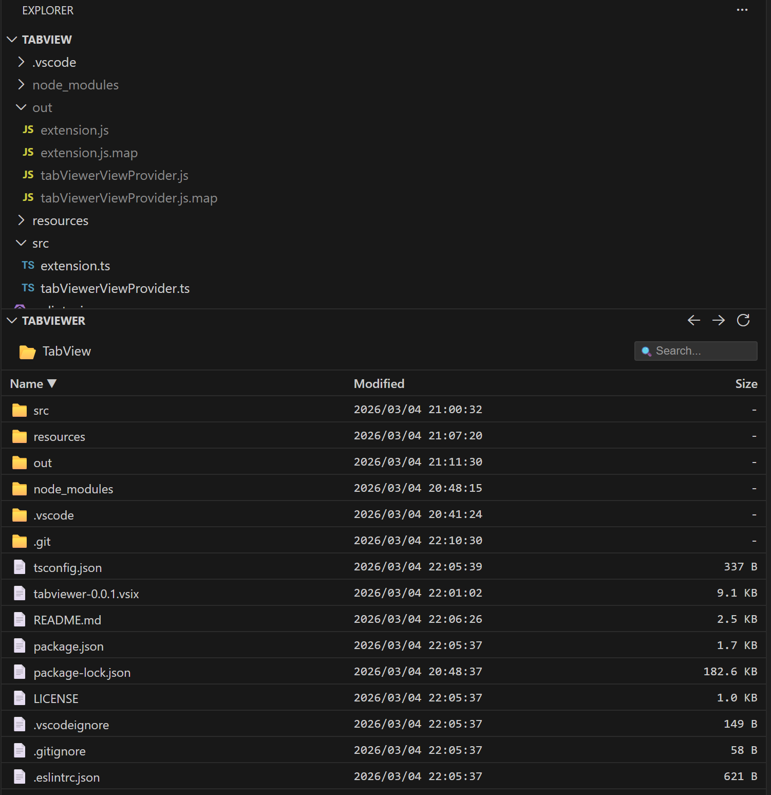

# TabViewer

A VS Code extension that provides a file explorer with a three-column layout displaying Name, Modified date, and Size.



## Features

- **Three-Column Layout**: Displays files and folders with Name, Modified date, and Size columns
- **Breadcrumb Navigation**: Navigate through directories with an intuitive breadcrumb interface
- **Search Functionality**: Real-time file search within the current directory and subdirectories
- **Navigation History**: Go back and forward through your navigation history
- **Auto Refresh**: Automatically updates when files or directories change
- **Sortable Columns**: Click on column headers to sort by Name, Modified date, or Size

## Installation

### From VSIX File

1. Download the latest `.vsix` file from the [Releases](../../releases) page
2. Open VS Code
3. Press `Ctrl+Shift+P` (Windows/Linux) or `Cmd+Shift+P` (macOS) to open the Command Palette
4. Type "Install from VSIX" and select "Extensions: Install from VSIX..."
5. Select the downloaded `.vsix` file

### From Source

```bash
git clone https://github.com/Dot4diw/TabViewer.git
cd tabviewer
npm install
npm run compile
npx vsce package
```

Then install the generated `.vsix` file following the steps above.

## Usage

1. Open a workspace/folder in VS Code
2. The TabViewer panel appears in the Explorer sidebar
3. Click on folders to navigate into them
4. Click on files to open them in the editor

### Navigation

| Action | Description |
|--------|-------------|
| **Go Up** (←) | Navigate to the previous directory in history |
| **Go Down** (→) | Navigate to the next directory in history |
| **Refresh** | Manually refresh the file list |
| **Breadcrumb** | Click on any path segment to navigate directly |

### Search

- Enter text in the search box to filter files
- Search is performed recursively within the current directory
- Clear the search box to return to the previous directory

## Commands

| Command | Description |
|---------|-------------|
| `tabViewer.refresh` | Refresh the file list |
| `tabViewer.navigateUp` | Navigate back in history |
| `tabViewer.navigateDown` | Navigate forward in history |

## Requirements

- VS Code 1.85.0 or higher

## License

This project is licensed under the MIT License - see the [LICENSE](LICENSE) file for details.

## Contributing

Contributions are welcome! Please feel free to submit a Pull Request.

## Changelog

### 0.0.1

- Initial release
- Three-column file explorer with Name, Modified, and Size
- Breadcrumb navigation
- Search functionality
- Navigation history (back/forward)
- Auto refresh on file system changes
